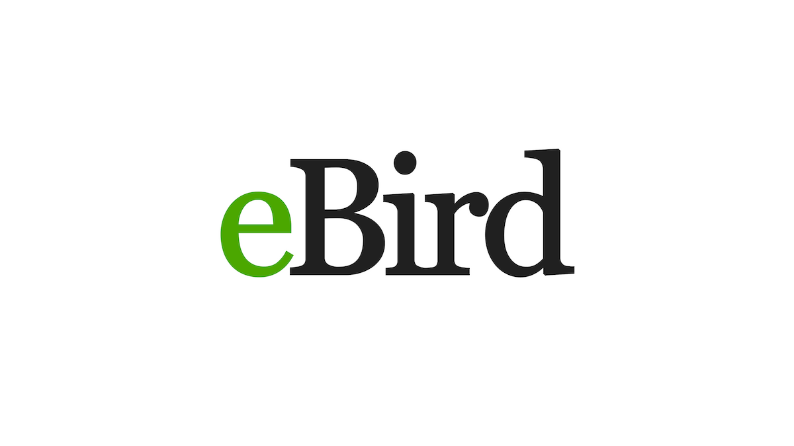

</img>

<h1 align="center">eBird API: Montana's Top Birds</h1>

<strong>Aquiring and Analzing a Dataset. </strong>
 The University of Montana, Master of Science in Business Analytics Class Assignment.  

 

<h2>About</h2>
This project centers around finding a dataset and acquiring and analyzing it. This project uses eBird data to help drive insights about birds in Montana. 

<h2>Goal and requirements</h2>

The requirements are deciding a topic of interest, acquiring the data, and analyzing and presenting it to the professor and class. The requirements are to use Python to achieve this. 

<h2>Key learnings</h2>

1. Utilizing API Wrappers that are common and well-documented help create efficient work. 
2. Combining multiple datasets helps develop impactful stories to bring life to findings.
3. eBird is a citizen science based app and has limitations for the amount of data that can be found in one state. 

<h2>Project status</h2>
This project is finished for now. I would like to organize this data into a pandas data frame to create a nice presentable piece. Additionally, I would like to keep recording birds over time. 

<h2>Credits</h2>

- ProjectBlabber/ebird-api
- eBird
- adrianmrit/flickrdatasets: FlickerAPI
- Western Meadowlark Artwork : Shalmons

<h2>Copyright</h2>
eBird API is available under the terms of the MIT licence.
